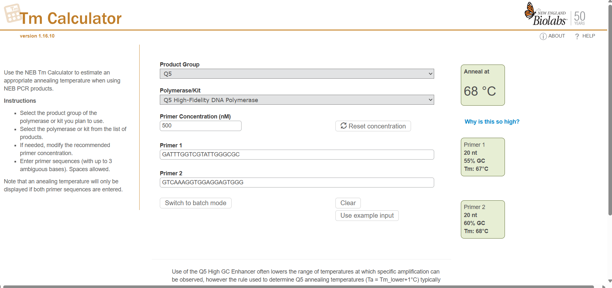

# In Silico PCR Primer Design and Validation Workflow

## Project Overview
This project demonstrates a complete dry-lab workflow for designing and validating PCR primers using bioinformatics tools.

## Step 1 – Primer Design (Primer3)

### Objective
Design PCR primers targeting the human GAPDH transcript variant 1 (NM_002046.7) using Primer3.

### Target Region
Specified target positions: 340, 500  
Product size range allowed: 100–1000 bp  

### Primer3 Settings

- Primer Length: Min 18 | Opt 20 | Max 24
- Primer Tm: Min 58°C | Opt 60°C | Max 62°C
- Max Tm difference between primer pairs: 5°C
- GC Content: Min 40% | Opt 50% | Max 60%
- Thermodynamic model: SantaLucia 1998
- Max 3’ stability: 9.0
- Max library mispriming: 12.00
- Pair max library mispriming: 20.00
- Number of primer pairs returned: 5

### Selected Primer Pair

Forward Primer  
Sequence: GATTTGGTCGTATTGGGCGC  
Length: 20 bp  
GC%: 55%  
Tm (Primer3): 59.97°C  
Start position: 105  

Reverse Primer  
Sequence: GTCAAAGGTGGAGGAGTGGG  
Length: 20 bp  
GC%: 60%  
Tm (Primer3): 59.96°C  
Start position: 964  

Expected Product Size: 860 bp  

### Pair Quality Metrics

- Pair Any_TH complementarity: 0.00  
- Pair 3’_TH complementarity: 0.00  
- No significant hairpin structures detected  
- No problematic self- or cross-dimer formation  

### Rationale for Selection

The selected primer pair was chosen based on:
- Nearly identical melting temperatures (~60°C)
- Acceptable GC content within defined constraints
- Absence of significant secondary structure
- Zero 3’ complementarity risk
- Acceptable mispriming scores

Additional primer pairs were generated; however, the selected pair showed optimal thermodynamic balance and clean complementarity metrics.

---

## Step 2 – Thermodynamic Validation (NEB Tm Calculator)

### Objective
Validate primer melting temperatures under realistic PCR buffer conditions using NEB Tm Calculator.

### Tool Used
NEB Tm Calculator (Q5 High-Fidelity DNA Polymerase)

### Reaction Conditions
- Polymerase: Q5 High-Fidelity DNA Polymerase
- Primer concentration: 500 nM
- Default NEB salt conditions (Q5 buffer system)

### Results

| Primer | Length | GC% | Tm (NEB) |
|--------|--------|------|----------|
| Forward | 20 nt | 55% | 67°C |
| Reverse | 20 nt | 60% | 68°C |

Recommended Annealing Temperature: **68°C**

### Interpretation

Compared to Primer3 (~60°C), NEB-calculated Tm values are higher because:

- Primer3 uses generalized thermodynamic assumptions
- NEB uses polymerase-specific buffer conditions
- Salt concentration and primer concentration significantly influence Tm

The 1°C difference between primers indicates excellent thermodynamic balance, ensuring synchronized annealing during PCR.

