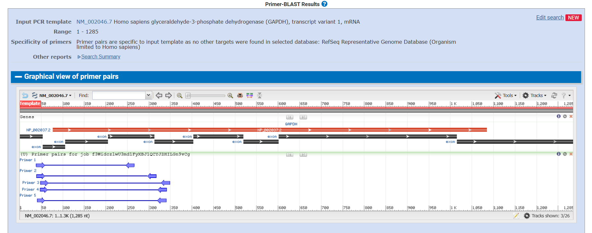
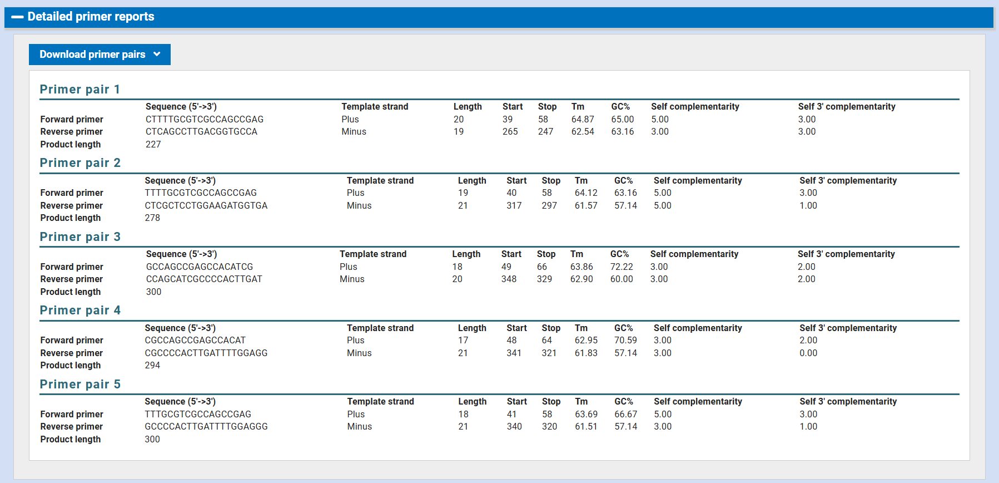

# Step 3B – Primer Redesign Using Primer-BLAST

Following the detection of significant off-target amplification in the initial Primer3 design (Step 3A), primer redesign was performed using NCBI Primer-BLAST to improve genome-wide specificity.

---

## Tool Used

- Tool: NCBI Primer-BLAST  
- Template accession: NM_002046.7  
- Gene: GAPDH (Homo sapiens)  
- Database: RefSeq Representative Genome  
- Organism: Homo sapiens  

---

## Design Parameters

The following optimized parameters were applied:

### Primer Length
- Min: 20 bp  
- Opt: 22 bp  
- Max: 25 bp  

### Melting Temperature (Tm)
- Min: 60°C  
- Opt: 62°C  
- Max: 65°C  

### PCR Product Size
- Min: 100 bp  
- Max: 300 bp  

### Specificity Parameters
- Require at least 2 mismatches to unintended targets  
- At least 1 mismatch within the last 5 bases at the 3’ end  

These stricter criteria were applied to eliminate the off-target amplification observed in the initial design.

---

## Primer-BLAST Output

Primer-BLAST generated five candidate primer pairs.

Primer-BLAST reported that all primer pairs were specific to the input template, and no additional genomic targets were identified within the selected RefSeq representative genome database.

A graphical overview of primer positions across the GAPDH transcript is shown below:

---

## Detailed Primer Report

The table below shows thermodynamic parameters and structural metrics for all five candidate primer pairs:

---

## Candidate Evaluation and Final Selection

Among the five primer pairs:

- Primer Pair 1 showed balanced Tm values (ΔTm ≈ 2°C)
- GC content remained within acceptable limits
- Self-complementarity scores were low
- No significant 3’ end complementarity risk was observed
- Amplicon size (227 bp) falls within the optimal PCR range

Based on these criteria, Primer Pair 1 was selected.

---

## Final Selected Primer Pair

**Primer Pair 1**

Forward (5’→3’):  
CTTTTGCGTCGCCAGCCGAG  

Reverse (5’→3’):  
CTCAGCCTTGACGGTGCCA  

Product Size: 227 bp  

---

## Conclusion

The redesigned primers demonstrated improved thermodynamic balance and strong genome-wide specificity.

Compared to the initial Primer3 design, the Primer-BLAST redesign successfully eliminated off-target amplification and produced a more reliable primer pair suitable for downstream PCR applications.
